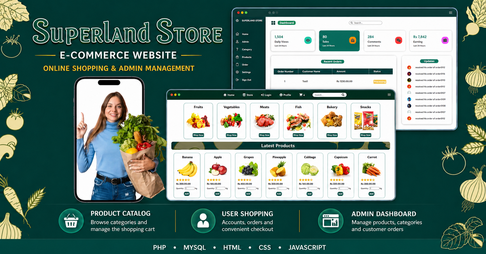

# SuperLand E-Commerce Website with Admin Dashboard

SuperLand is a PHP and MySQL based e-commerce web application developed as an academic web development project. It includes a customer shopping website and an admin dashboard for managing products, categories, and admin users.

<p align="center">
  
</p>


## Features

### Customer Side

- Customer registration and login
- Product browsing
- Category browsing
- Product search
- Add products to cart
- Update cart quantities
- Checkout page
- Customer profile update

### Admin Side

- Admin login
- Admin dashboard
- Add, edit, and delete products
- Add, edit, and delete categories
- Add, edit, and delete admin users

## Technologies Used

- PHP
- MySQL / MariaDB
- HTML
- CSS
- JavaScript
- phpMyAdmin
- Wampserver or XAMPP

## Project Structure

```text
SuperLand/
├── admin/                  # Admin dashboard pages
├── customer/               # Customer-side pages
├── config/                 # Database connection file
├── assets/                 # CSS, JavaScript, and project images
│   ├── css/
│   ├── js/
│   └── images/
│       ├── products/
│       ├── categories/
│       ├── dashboard/
│       └── users/
├── uploads/                # Runtime upload folders
│   ├── products/
│   └── users/
├── database/               # SQL database file
├── docs/                   # Installation and user documentation
├── index.php               # Main website page
├── about.php
├── contact.php
├── terms.php
├── README.md
└── .gitignore
```

## Requirements

Install one local PHP server package:

- Wampserver, or
- XAMPP

The local server should include Apache, PHP, MySQL or MariaDB, and phpMyAdmin.

## Database Setup

Database name:

```text
superland_db
```

Database file:

```text
database/superland_db.sql
```

Import this SQL file using phpMyAdmin before running the project.

## Database Connection

The database connection file is:

```text
config/db.php
```

Default settings:

```php
$DB_HOST = 'localhost';
$DB_USERNAME = 'root';
$DB_PASSWORD = '';
$DB_DATABASE = 'superland_db';
$DB_PORT = 3306;
```

If your MySQL server uses a password, update only this value in `config/db.php`:

```php
$DB_PASSWORD = 'your_mysql_password';
```

## How to Run

1. Place the `SuperLand` folder inside the local server directory.

For Wampserver:

```text
C:\wamp64\www\SuperLand
```

For XAMPP:

```text
C:\xampp\htdocs\SuperLand
```

2. Start Apache and MySQL.

3. Open phpMyAdmin and import:

```text
database/superland_db.sql
```

4. Open the website in a browser:

```text
http://localhost/SuperLand/
```

## Default Demo Login Details

### Admin Login

```text
URL: http://localhost/SuperLand/admin/AdminDashboard.php
Email: admin@superland.com
Password: admin123
```

### Customer Login

```text
URL: http://localhost/SuperLand/customer/Login.php
Email: user@superland.com
Password: user123
```

## Main Pages

```text
Home: http://localhost/SuperLand/
Admin: http://localhost/SuperLand/admin/AdminDashboard.php
Customer Login: http://localhost/SuperLand/customer/Login.php
Cart: http://localhost/SuperLand/customer/cart.php
Checkout: http://localhost/SuperLand/customer/checkout.php
```

## Documentation

Additional user documentation is available here:

```text
docs/INSTALLATION.md
docs/USER_GUIDE.md
docs/PROJECT_STRUCTURE.md
```

## Notes

This is an academic project intended for learning and portfolio demonstration. Before using it in a real production environment, improve security by adding prepared statements, stronger password hashing, input validation, CSRF protection, and role-based access control.
